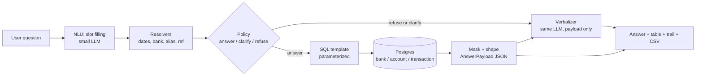
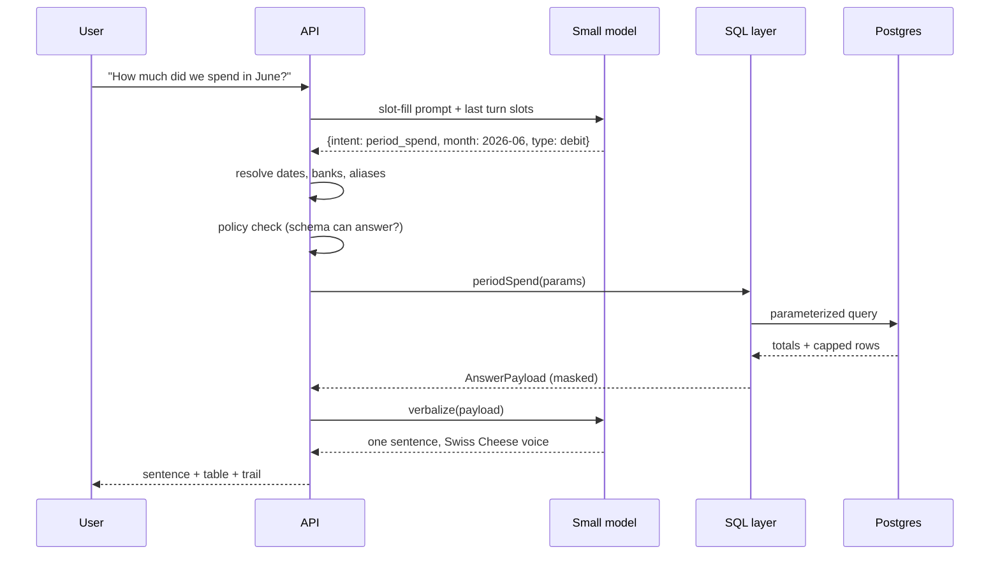
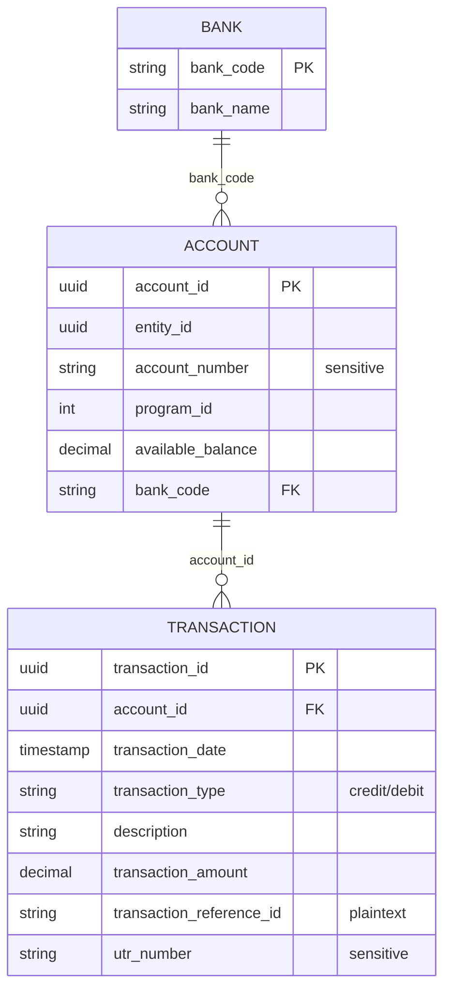

# Swiss Cheese - architecture

Spec: [REQUIREMENTS.md](REQUIREMENTS.md) · Gold answers: [EXAMPLES.md](EXAMPLES.md) · Schema: [SCHEMA.md](SCHEMA.md)

## Core idea

Swiss Cheese is a **query engine with a thin voice on top**. The model never touches the database and never does arithmetic. It fills slots on the way in and reads a computed JSON payload on the way out. Everything between those two points is deterministic code.

That single split is what makes a hallucinated figure structurally impossible: the verbalizer has no numbers except the ones SQL produced.

## Pipeline



The table, the trail, and the CSV are rendered from `AnswerPayload` directly. The LLM output is only the prose sentence. If the model fails or times out, the UI still shows a correct table.

## Module responsibilities

| Module | Owns | Never does |
|---|---|---|
| `nlu` | Question to `Slots` JSON, with confidence | Write SQL, name a bank, compute dates |
| `resolve` | FY date bounds, bank lookup, description aliases, ref vs UTR routing | Guess when confidence is low |
| `policy` | Answer / clarify / refuse decision, empty-window handling | Fabricate a proxy and call it official |
| `sql` | One function per intent, parameterized, capped rows | Accept model-authored SQL strings |
| `mask` | Account masking, UTR removal, money formatting | Let a raw sensitive field into a payload |
| `verbalize` | One sentence from `AnswerPayload` | See raw rows, do math, invent a total |
| `eval` | Score models on the frozen set | Skip a case because it is slow |

## Request lifecycle



## Contracts

Two types are the spine of the system. Changing them is an architecture decision, not a refactor.

```ts
/** Everything the model is allowed to extract from a question. */
type Slots = {
  intent: Intent;
  dateFrom?: string;        // resolved by code, not the model
  dateTo?: string;
  bankCode?: string;        // must exist in the bank table
  programId?: number;
  txType?: "credit" | "debit";
  counterparty?: string;    // alias key, not free text
  reference?: string;
  refField?: "reference_id" | "utr";
  amountMin?: number;
  amountMax?: number;
  confidence: number;
};

/** Everything the verbalizer is allowed to see. */
type AnswerPayload = {
  kind: "answer" | "clarify" | "refuse" | "empty";
  intent: Intent;
  headline: { label: string; value: string }[];   // preformatted INR strings
  table: { columns: string[]; rows: string[][] }; // already masked
  trail: { template: string; filters: Record<string, string>; rowCount: number };
  alternatives?: string[];   // for refuse and empty
  notes?: string[];          // match confidence, concentration, anomaly flag
};
```

Numbers reach the model as **formatted strings**. There is nothing left to compute.

## Intent catalog

| Intent | Question shape | Query core |
|---|---|---|
| `cash_position` | Cash across banks now | `SUM(available_balance)` grouped by `bank_code` |
| `period_spend` | Spend in a window, optional counterparty | `SUM` debits in bounds |
| `inflow_outflow` | Credits vs debits for a period | `SUM` split by `transaction_type` |
| `counterparty_breakdown` | Who are we paying most | Group debits by alias, with share |
| `compare_period` | Versus the month before | Replay prior slots, shifted bounds |
| `lookup_reference` | Pull up ref X | Point read on `transaction_reference_id` |
| `missing_reference` | Labeled recon proxy | Debits with NULL reference |
| `clarify_counterparty` | Ambiguous vendor name | Candidate aliases with totals, no single answer |
| `refuse` | Out of schema | No query, reason plus alternatives |

Adding an intent means adding a SQL function, a gold case, and an eval line. All three, or none.

## Model layer

One interface, two calls, swappable implementation. That is the whole model-efficiency story.

```ts
interface ChatModel {
  fillSlots(question: string, context: Slots | null): Promise<Slots>;
  verbalize(payload: AnswerPayload): Promise<string>;
}
```

- Baseline: `qwen3.8:27b` locally, for engineering and a reference score.
- Judged run: a ≤20B model behind the same interface, scored on the same harness.
- Swapping models changes no SQL, no resolver, no gold number. Only the two prompts move.

## Eval harness

```
questions (12 gold) → run pipeline → compare vs EXAMPLES.md → scorecard per model
```

Scored dimensions, kept separate so a regression is legible: intent match, slot match, number exact-match, correct refuse, no leaked sensitive field, latency.

Unit tests (`test/`, Mocha + Chai + Sinon) cover resolvers and SQL templates with a stubbed model. Live model runs live in `*.e2e.test.ts` and stay out of `npm test`.

## Scale and safety

Database is **Postgres**. Driver is `pg` with `$1` placeholders; no string-built SQL anywhere.

- B-tree on `transaction(transaction_date)`, `transaction(account_id)`, `transaction(transaction_reference_id)`, `account(bank_code)`.
- Counterparty matching is `ILIKE '%alias%'`, which cannot use a B-tree. Add a **GIN trigram** index on `transaction(description)` via `pg_trgm`, or alias matching will table-scan 20M rows.
- Money stays `numeric(15,2)` end to end. Never `float`, never JS `number` for a total.
- Aggregates run in SQL. The UI table is capped; the total is never capped.
- Masking happens in the payload builder, so no code path can print a raw account number or UTR.
- Encrypted UTR cannot use a plain `WHERE =`. It is searched only when the user explicitly says UTR.

## Layout

```
src/nlu · src/resolve · src/policy · src/sql · src/mask · src/verbalize · src/api · src/eval
test/   · docs/       · db/seed.sql
```

## Database modeling

Tables, columns, keys, and types stay exactly as [SCHEMA.md](SCHEMA.md) defines them. That DDL is written in MySQL dialect, so `db/seed.sql` carries the Postgres translation. Shape does not change; only dialect does.

| SCHEMA.md (MySQL) | Postgres | Note |
|---|---|---|
| `ENGINE=InnoDB DEFAULT CHARSET=utf8mb4` | dropped | Not a Postgres concept |
| `ENUM('credit','debit')` | `VARCHAR(10)` + `CHECK (transaction_type IN ('credit','debit'))` | Keeps the two allowed values without a custom type to migrate |
| `TIMESTAMP(6)` | `timestamp(6)` | Microsecond precision preserved |
| `DECIMAL(15,2)` | `numeric(15,2)` | Same semantics |
| `VARCHAR(36)` ids | unchanged | Stay strings, per schema. Do not switch to `uuid` |
| `LIKE` on description | `ILIKE` | Case-insensitive alias matching |

`transaction` is a non-reserved keyword in Postgres, so the table name works unquoted.


