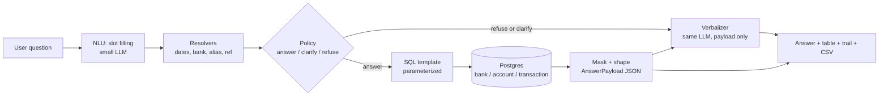

# Swiss Cheese

A conversational finance assistant for a group-treasury desk.

**Every number on this screen came out of Postgres.** The model wrote the sentence around it and filled in the filters. It never saw a row and it never did arithmetic.

```
question -> slots (model) -> resolvers -> policy -> SQL template -> payload -> sentence (model)
```

This note is the presentation: the claim, the architecture, the five questions that prove it, the model story, and the live run sheet. Gold answers live in [EXAMPLES.md](EXAMPLES.md). The full pipeline note is [ARCHITECTURE.md](ARCHITECTURE.md).

**Clock:** 5 Sep 2026 (`CHEESE_AS_OF`). **Currency:** INR. **Calendar:** Indian FY, April to March.

**Screenshots:** drop captures in `docs/screenshots/` using the filenames below. Each section cites the file it expects.

| File | What to capture |
|---|---|
| `00-ui.png` | The chat shell, empty or with the first question typed |
| `00-settings.png` | Settings drawer: service and model are swappable |
| `00-architecture.png` | Pipeline slide or the mermaid below, if you render it |
| `01-cash-position.png` | Cash-by-bank answer card |
| `01-trail.png` | "How this was produced" expanded on that card |
| `02-empty-window.png` | Last-month empty window |
| `03-june-spend.png` | June spend table |
| `03-compare.png` | "Month before" comparison |
| `04-clarify-selection.png` | Ambiguous "Selection" clarify |
| `05-refuse-recon.png` | Unreconciled refusal plus missing-ref proxy |
| `06-eval.png` | Gold-slot scorecard in the terminal |

---

## 1. The problem (45s)

Finance teams still answer the same questions from dashboards and exports: cash by bank, spend last month, what we paid a vendor, is this still open.

A wrong number here is not a chatbot glitch. It is a figure someone might take into a reconciliation or a board pack.

The hackathon constraint makes that worse, not better: a model at or under 20B, a schema you cannot extend, and 20 million rows as the scale target. The model is not allowed to invent a total when the column does not exist.

**What we built:** a chat that answers the questions the schema can support, shows the rows behind the total, and refuses the rest in plain language.


---

## 2. The one idea (45s)

A language model is a bad calculator and a good clerk. Swiss Cheese uses it as a clerk.

| The model does | Code does | Postgres does |
|---|---|---|
| Read the question into slots | Resolve dates, banks, aliases | Parameterized SQL templates |
| Phrase one sentence from a finished payload | Policy: answer / clarify / refuse / empty | Aggregates on `numeric(15,2)` |

The verbalizer never sees raw rows. Amounts arrive as already-formatted strings. If the phrasing call times out, the table and the trail still render. The sentence falls back to a template built from the same payload.

That split is the product. A hallucinated figure is structurally hard, not "please do not invent numbers" in a prompt.


Open the settings drawer for one beat. Point at the service and model. Then close it.

> "We can change the model without changing a total. The judged entry is whatever sits behind those two calls. The SQL does not move."

---

## 3. Architecture (90s)

Swiss Cheese is a query engine with a thin voice on top. The model never touches the database and never does arithmetic. It fills slots on the way in and reads a computed JSON payload on the way out. Everything between those two points is deterministic code.

That split is what makes a hallucinated figure structurally hard: the verbalizer has no numbers except the ones SQL produced.




The table, the trail, and the CSV render from `AnswerPayload` directly. The LLM output is only the prose sentence. If the model fails or times out, the UI still shows a correct table.

> "Walk left to right. Language in, language out. Postgres in the middle. The model is not in the path that produces a total."

### Who owns what

| Module | Owns | Never does |
|---|---|---|
| `nlu` | Question to slots JSON | Write SQL, name a bank, compute dates |
| `resolve` | FY bounds, bank lookup, aliases, ref vs UTR | Guess when confidence is low |
| `policy` | Answer / clarify / refuse / empty | Call a proxy "official" |
| `sql` | One parameterized template per intent | Accept model-authored SQL |
| `mask` | Account mask, UTR suppression, INR format | Let a raw sensitive field into a payload |
| `verbalize` | One sentence from the payload | See raw rows, do math, invent a total |

Two contracts are the spine. Changing them is an architecture decision, not a refactor.

- **Slots** are everything the model may extract: intent, the user's date wording, a counterparty name, a reference. Dates, bank codes, and alias keys are resolved by code after that.
- **AnswerPayload** is everything the verbalizer may see: kind (`answer` / `clarify` / `refuse` / `empty`), headline figures as formatted INR strings, a masked table, and the trail. There is nothing left to compute.

### Closed intent catalog

Adding an intent means adding a SQL function, a gold case, and an eval line. All three, or none. No free-form text-to-SQL.

| Intent | Question shape | Query core |
|---|---|---|
| `cash_position` | Cash across banks now | `SUM(available_balance)` by `bank_code` |
| `period_spend` | Spend in a window, optional vendor | `SUM` debits in bounds |
| `inflow_outflow` | Credits vs debits | `SUM` split by type |
| `counterparty_breakdown` | Who we pay most | Group by alias, with share |
| `compare_period` | Versus the month before | Replay prior slots, shifted bounds |
| `lookup_reference` | Pull up ref X | Point read on `transaction_reference_id` |
| `missing_reference` | Labelled recon proxy | Debits with a NULL reference |
| `clarify_counterparty` | Ambiguous vendor | Candidate aliases, no single total |
| `refuse` | Out of schema | No query, reason plus alternatives |

Schema is three tables and stays three tables: `bank`, `account`, `transaction`. Money stays `numeric(15,2)` end to end. Aggregates run in SQL. The UI table is capped; the total is not. Indexes cover date, account, reference, and a GIN trigram on `description` so alias match does not table-scan 20M rows.

The model layer is one interface, two calls, swappable implementation. That is the whole efficiency story. Details stay in [ARCHITECTURE.md](ARCHITECTURE.md).

---

## 4. Demo beat 1 - it answers (60s)

**Ask:** *What is our cash position across banks right now?*

**Expect:** net available cash **INR -8,12,29,672.84** across 10 accounts. Axis holds the surplus. HDFC and ICICI more than offset it.


This is `account.available_balance`, a live snapshot. It is not a sum of transactions. Cash and period movement are never mixed.

Expand **How this was produced**. Point at `template: cash_position` and the row count.


> "That is the trail. Every answer has one. A treasury team does not need to trust the assistant. They need to be able to check it."

Also point at an account cell: `HDFC 5020****9069`. Masking happens in the payload builder. UTR is never printed.

CSV export sits on the same card. The download is the table the user is looking at, not a second query.

---

## 5. Demo beat 2 - it declines to fill the silence (60s)

**Ask:** *How much did we spend last month?*

August 2026 has no debit rows. Swiss Cheese says the window is empty and offers June 2026 with its real total. It does not print zero as if it had counted, and it does not invent a figure to stay helpful.


> "This is the failure mode that matters. An ungrounded assistant produces a confident number here. Swiss Cheese reports an empty window, and the alternative it offers is itself a query result."

---

## 6. Demo beat 3 - follow-up without repeating context (75s)

**Ask:** *How much did we spend in June?*

**Expect:** **INR 1,69,299.00** across 4 debits, all on `HDFC 5020****9069`.


**Then ask:** *How does that compare to the month before?*

The second question names no window. The server reuses the June slots and shifts the bounds back one month: May 2026, **INR 71,156.00**, June higher by **INR 98,143.00**.


> "The model was told 'the month before'. It did not work out what that meant. It reported the phrase, and code resolved it against a fixed clock and the previous turn."

---

## 7. Demo beat 4 - it asks instead of picking (75s)

**Ask:** *How much did we pay Selection last quarter?*

There is no vendor master. Counterparties live inside statement text. "Selection" hits four aliases in Q1 FY26-27. Swiss Cheese lists all four, plus a combined **INR 2,19,299.00** if the user means every match, and it does not return a single winner.


"Last quarter" resolved to April-June, not January-March. Indian fiscal year, handled in code, not in the model.

> "Guessing which Selection was meant would produce a number that is precise and wrong, so it asks."

---

## 8. Demo beat 5 - the schema gap, stated plainly (60s)

**Ask:** *Which transactions are still unreconciled?*

The schema has no reconciliation status, no invoice table, and no ledger to match against. Swiss Cheese refuses. Then it offers a labelled proxy: the one transaction with a missing reference number, **INR 110.00**, and it says a missing reference is not the same as unreconciled.


> "A deterministic pre-check catches this before a total can be computed. Whatever intent the model guesses, this question cannot become a number we do not have."

Same pattern for budget vs actual, P&L, and cash as of a past Friday. `available_balance` is a current snapshot. There is no running history to reconstruct.

---

## 9. Model choice (60s)

The hackathon scores model efficiency. Bigger is not better. The architecture is how a small model stays accurate: it only does two jobs.

| Call | Input | Output | Can it change a number? |
|---|---|---|---|
| `fillSlots` | The question, plus a one-line recap of the last turn | Intent and the user's wording | Indirectly, if it picks the wrong intent or date phrase |
| `verbalize` | Payload with amounts already formatted | One sentence | No. It copies figures. It does not compute them |

Baseline for engineering: `qwen3.8:27b`. That is over the 20B cap, so it is a reference row only. The judged entry is any model at or under 20B behind the same interface. Swapping `AI_MODEL` changes no SQL, no resolver, and no gold total.

What to say if asked "why not a frontier model":

> "A frontier model would still be banned from the database. The constraint we accepted is that language is the only thing the model is for. If a 8B or 14B model can fill slots, the totals stay exact."

The model card is [MODEL-CARD.md](MODEL-CARD.md). Fill the judged row from `eval/out/` before the presentation. Do not demo a model that has no score on the frozen set.

---

## 10. Evals are the proof (60s)

Twelve frozen conversations in [EXAMPLES.md](EXAMPLES.md). Two harness modes, kept apart on purpose:

| Mode | What it feeds | A failure means |
|---|---|---|
| `--slots=gold` | Hand-written slots, no model | SQL, masking, or policy is wrong |
| `--slots=model` | The real NLU | Intent or slot extraction is wrong |

A number regression and a language regression therefore never look alike.


Scored separately: intent, outcome kind, number exact-match, row count, slots, no leaked account or UTR, latency. A fluent sentence with a wrong total is a fail.

If you have a second terminal during the live demo:

```
npm run eval
```

> "Gold-slot mode runs no model at all, so a failure means the engine is wrong. That is the control. Model-slot mode is how we know whether a smaller model still picks the right template."

---

## 11. What a treasury user can check

Every reply is the same contract:

1. One sentence, Swiss Cheese voice, figures copied exactly.
2. A breakdown table, already masked.
3. A trail: template name, filters, date bounds, row count.
4. On refuse or empty: why, then the nearest grounded alternative.

Locked product rules, in one breath:

- Cash is the balance snapshot. Period spend is credits minus debits. Never mixed.
- Vendors are aliases in `description`. Ambiguous name, ask.
- Bare "ref no" hits `transaction_reference_id`. UTR only if the user says UTR.
- Empty window stays empty. Missing reference is a proxy, never "unreconciled."

The schema is three tables and stays three tables. Details in [SCHEMA.md](SCHEMA.md) and [REQUIREMENTS.md](REQUIREMENTS.md).

---

## 12. Close (30s)

Swiss Cheese is a query engine with a thin voice on top.

- The questions a treasury desk actually asks get a number they can audit.
- The questions this schema cannot support get a refusal, not a guess.
- The model is replaceable. The totals are not.

Finish on the cash card and the trail, not on the persona.

---

## Live run sheet

Eight to nine minutes. Architecture first, then the same five questions. Through-line: the model does the language and nothing else.

**Before starting:** `npm run db:setup`, then `npm run dev`. Confirm `CHEESE_AS_OF=2026-09-05` so "last month" is August 2026 and the gold figures land.

| Clock | Beat | Line to say |
|---|---|---|
| 0:00 | Claim, then settings | "Every number came out of Postgres." |
| 0:30 | Architecture | "Language in, language out. Postgres in the middle." |
| 2:00 | Cash position | "This is the snapshot, and here is the trail." |
| 3:00 | Last month | "Empty, not invented." |
| 4:00 | June, then month before | "The model copied the phrase. Code shifted the window." |
| 5:15 | Selection last quarter | "Four counterparties. It asks." |
| 6:30 | Unreconciled | "No such column, so no such total." |
| 7:30 | Eval | "Gold slots prove the engine. Model slots prove the clerk." |

If time is short, keep the architecture slide plus beats 1, 3, 4, and 5. Those are EXAMPLES 1, 3, 5, and 10. Skip the eval terminal.

### If something goes wrong

| Symptom | Cause |
|---|---|
| Every question errors | `DB_CONNECTION_STRING` missing, or `npm run db:setup` not run |
| Dates land in the wrong month | `CHEESE_AS_OF` unset or overridden |
| Sentence is odd but the table is right | Verbalizer fell back. The grounded half is unaffected |
| Model call times out | The answer card still renders from the payload. Keep talking from the table |
